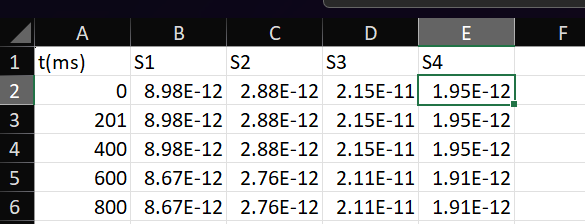

**Scientific background: **

photodetectors are devices that generate an electrical response (current) once subjected to light signals. Several new materials and different device geometries are being proposed in the literature, thus requiring several figures of merit to measure devices’ performance. Such as the devices photocurrent defined as the difference between the current produced once the device is illuminated and the current produced by the same device under no illumination, defined by Eq.1 

I_ph=Ion-I_(off/Dark)                                                                                                     Eq.1

In addition, an analogy to the signal to noise ration in these devices is the so called on/off ratio defined by Eq.2  

on/off =I_ph/I_Dark                                                                                                      Eq. 2                                                                                                                               
These metrics can be found by measuring the devices current with time, where the device is subject to pulses of light, in other words a graph of current with time, such as the one shown in the figure below. By measuring the current at a specify point in time it is possible to extract the current at that point, but for more rigorous analysis it is recommended to calculate the median of a given time window. 

The aim of this project is to introduce a simple software that facilitates these calculations. 

**Installation: **
 
To install the software, simply use these commands: 
git clone https://github.com/Hkasajy/Photocurrent-from-It-graphs.git
cd Photocurrent-from-It-graphs
pip install .
run-manual-picker

**Usage, input and output formats: 
**
The software currently takes .xlsx files, to prepare the input file simple add the time column, and the current values. The software supports multiple devices. Below is an example of an input file for It traces collected for 4 bar coated perovskite photodetector under increasing light power, this file is included in the package. 

 

