**Scientific background:**

photodetectors are devices that generate an electrical response (current) once subjected to light signals. Several new materials and different device geometries are being proposed in the literature, thus requiring several figures of merit to measure devices’ performance. Such as the devices photocurrent defined as the difference between the current produced once the device is illuminated and the current produced by the same device under no illumination, defined by Eq.1 

The photocurrent is defined as:

\[
I_{\mathrm{ph}} = I_{\mathrm{on}} - I_{\mathrm{off}}
\]

where \(I_{\mathrm{on}}\) is the current measured during illumination, and \(I_{\mathrm{off}}\) is the dark current measured when the device is not illuminated.

In addition, an analogy to the signal-to-noise ratio in these devices is the so-called on/off ratio, defined here as:

\[
\mathrm{OnOff} = \frac{I_{\mathrm{ph}}}{I_{\mathrm{off}}}
= \frac{I_{\mathrm{on}} - I_{\mathrm{off}}}{I_{\mathrm{off}}}
\]

These metrics can be found by measuring the devices current with time, where the device is subject to pulses of light, in other words a graph of current with time, such as the one shown in the figure below. By measuring the current at a specify point in time it is possible to extract the current at that point, but for more rigorous analysis it is recommended to calculate the median of a given time window. 

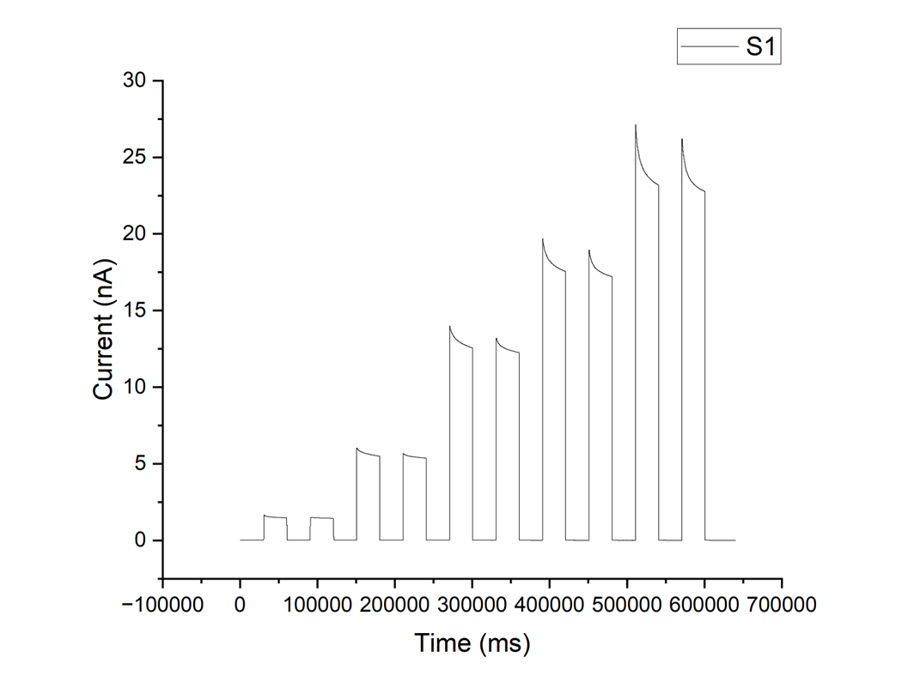

The aim of this project is to introduce a simple software that facilitates these calculations. 

**Installation:**
 
To install the software, simply use these commands: 

    git clone https://github.com/Hkasajy/Photocurrent-from-It-graphs.git
    cd Photocurrent-from-It-graphs
    pip install .
    run-manual-picker

**Usage, input and output formats:**

The software currently takes .xlsx files, to prepare the input file simple add the time column, and the current values. The software supports multiple devices. Below is an example of an input file for It traces collected for 4 bar coated perovskite photodetector under increasing light power, this file is included in the package. 

 

The user can name the columns as they wish, where the first cell of the column is assumed to be the device index which will be conserved in the output file.

Once the software is run, a popup will allow the user to select an input file as shown here,

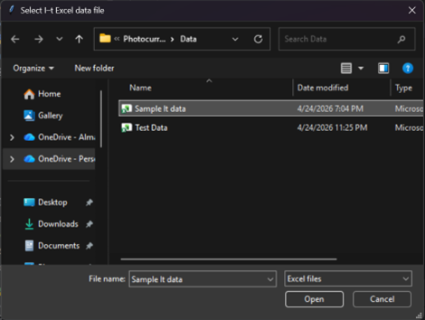

Once the user selects the input file in this example (Sample It data), another popup will ask the user to select where to save the resulting output data here called (Sample It data_Results)

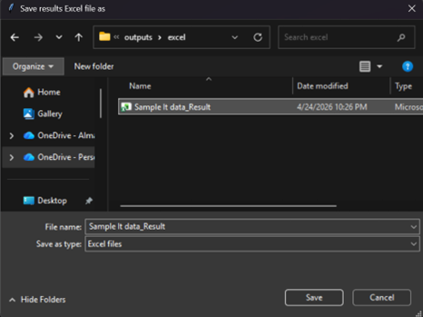

The package includes a folder to save the output, but the user is free to select any location on their device to save the data. The only limitation on naming is that the output cannot have the same name as the output file. 

Then one final popup will ask the user to select the time column, this provides the user with more freedom when preparing the input excel sheet, and to avoid any possible errors. 

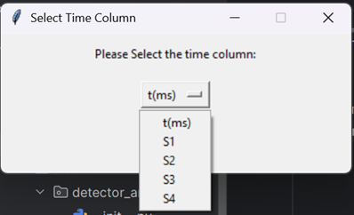

Once the user selects their files and time column, to assure propre data loading, a graph with all devices in the input file will be shown.

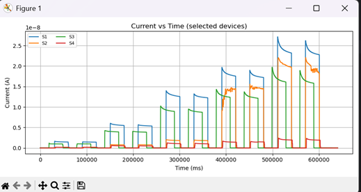

Once the user exits this window with the x button, the main part of the software starts, where a graph for each device in the input file will be shown one by one, such as device S1 shown here. 

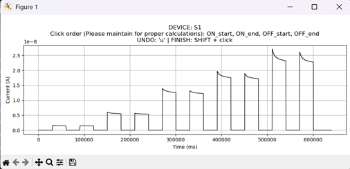

The basic commands are shown in the figure and are clear to the user, but are restated here.

Each click will register a horizontal line in the graph defining the start of a time window, as shown 

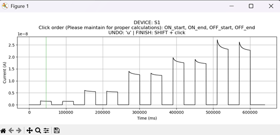

First click will register the start and the second will register the end of the window. 

First two clicks will define the on window (Red shading), and the last two clicks will define the off window (Blue shading), as shown

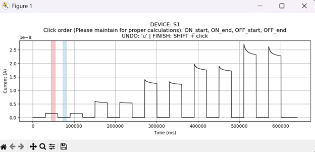

The user then can continue with defining windows, the end result could look like this 

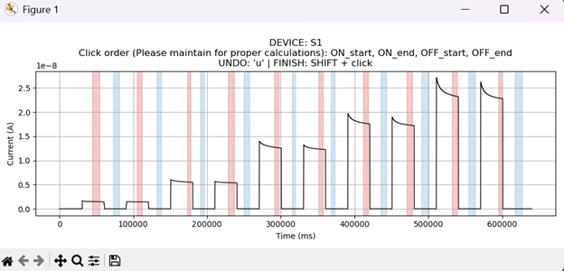

However, the user is free to select as many windows as required. 

The final output data will be saved in an excel file such as this one 

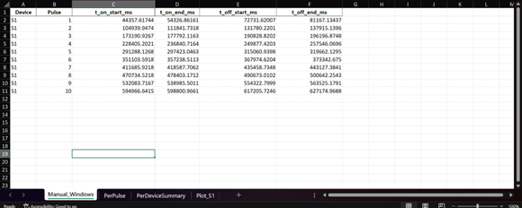

The first sheet called Manual_Windows shows the index of each device analyzed, each peak will be numbered, then for each peak the user selected time “clicks” are shown. 

The second sheet called PerPulse shown below also contains the device and pulse index, the on current, off current, photocurrent, its absolute value, and the on off ratio. The same clicks are also shown here for competence, and finally the calculation method. 

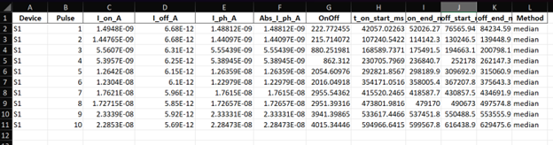

The third sheet called PerDeviceSummary shown below should only be used to detect large variations across a batch of devices, where it shows simple statistics of previously discussed metrics. 

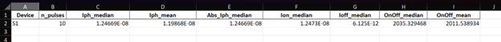

Finally, for each device in the input file, a graph is saved showing the time windows that were defined by the user, as shown below. 

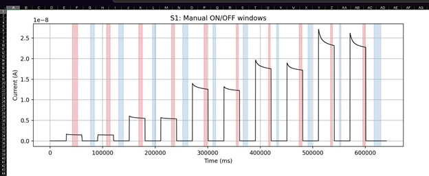

**Testing:**

The project includes both automated tests for the numerical and non-interactive parts of the pipeline, and due to the complexity of GUI, a manual checklist for the graphical user interface testing was created and tested. 

For running the tests

Simply install the package with testing dependencies using 

    pip install -e ".[test]"
    pytest

All tests are located in the tests/ directory as follows:

test_metrics.py

This file tests the core numerical functions used to extract photocurrent-related quantities from selected ON/OFF windows.
It verifies that:
current values are correctly extracted from selected time windows, median and mean window statistics behave correctly, insufficiently populated windows return NaN, and that the photocurrent and on/off ratio is computed as defined previously.

test_io.py

This file tests input-handling and validation functions.
It verifies the following: all device columns are correctly detected when devices_to_do="ALL" , the selected device columns are correctly resolved for missing time columns raise a clear error, and requested device columns that are not present in the input data raise a clear error.

test_pipeline.py

This file tests the non-interactive analysis pipeline using controlled sample data.
It verifies the following workflow: 
Excel input file from data loading, to device columns resolving, to the predefined on/off windows, the computed photocurrent metrics, the output excel sheeting writing, and finally verifies the expected outputs. 

Manual UI testing

This checklist verifies the following manually, input-file selection, output-file selection, time-column selection, overview plotting, ON/OFF window selection, undo behavior, SHIFT-click device completion , and creation of output Excel file and plot sheets. 

**Limitations and future improvements:**

The following limitations and future improvements are listed for version 0.1.0

Only .xlsx files are accepted as input and output, in future versions this could be expanded. 

The software assumes the input data is contained in the first sheet, this can be changed in the configuration defaults in cli.py file line 26. In future versions, a GUI should be added to allow the user to select which sheet contains the input data. 

An algorithm to automatically detect on and off windows can be added to future versions, and the user can select which method to use. 

While there are several methods to calculate on off rations, this version assumes dynamic measurements, the most common method used in this type of experiments, initial and final dark current methods can be added in future versions. 

**Generative AI statement:**

In accordance with the principles of honesty, transparency, and accountability stated in the University of Bologna policy for an ethical and responsible use of generative artificial intelligence (GenAI), in particular the use of generative artificial intelligence in “Use cases of generative artificial intelligence in preparing student work to be assessed” such as the “generating or explaining a programming code” (found here), the author decliners that ChatGPT 5.4  and ChatGPT 5.5 were used to help in generating this code, where active supervision and critical thinking were employed to account for the generated results, thus complying with the university policy principles. The author takes full responsibility for this code, and the provided example data which were collected by the author. 
